<div align="center">

<!--
  SALMAN KHAN — GITHUB PROFILE
  Visual system: Black / White / Crimson Red
  Keep the custom terminal_card.svg in ./assets/
-->

<a href="https://github.com/codewithsalty">
  
</a>

<br/>


<br/>


</div>

---

<table>
<tr>
<td width="58%" valign="top">

## `01 / ABOUT`

I’m **Salman Khan**, a Full Stack AI Engineer focused on turning AI research and prototypes into usable, production-oriented systems.

My work sits at the intersection of:

- **LLM applications & RAG**
- **AI agents & orchestration**
- **Computer vision**
- **Voice AI**
- **ML / NLP systems**
- **Full-stack AI products**

Currently pursuing a **BS in Artificial Intelligence at NUML** while building and shipping real-world AI systems.

</td>
<td width="42%" valign="top">

### `SYSTEM STATUS`

```text
┌────────────────────────────┐
│ ● ONLINE                   │
│                            │
│ ROLE     AI ENGINEER       │
│ FOCUS    AI SYSTEMS        │
│ STACK    PYTHON / TS       │
│ MODE     BUILD             │
│ LOCATION ISLAMABAD, PK     │
└────────────────────────────┘
```

</td>
</tr>
</table>

---

## `02 / WHAT I BUILD`

<div align="center">

| `LLM SYSTEMS` | `AI AGENTS` | `RAG` | `COMPUTER VISION` |
|:---:|:---:|:---:|:---:|
| Context-aware AI | Autonomous workflows | Grounded retrieval | Real-time detection |

| `VOICE AI` | `ML SYSTEMS` | `AUTOMATION` | `FULL-STACK AI` |
|:---:|:---:|:---:|:---:|
| STT / TTS / realtime | Training & inference | API + workflow automation | End-to-end products |

</div>

---

## `03 / SELECTED PROJECTS`

<table>
<tr>
<td width="50%" valign="top">

### SURAKSHA AI

**Defense Intelligence / Computer Vision**

Real-time surveillance platform using modern object detection and NLP-based threat analysis.

`YOLOv8/v11` `PyTorch` `FastAPI` `DistilBERT`

**92% drone recall · 30 FPS · 90% F1**

[Source](https://github.com/codewithsalty/Suraksha-AI) · [Demo](https://suraksha-ai-pakistan.netlify.app)

</td>
<td width="50%" valign="top">

### TALEEM AI

**Bilingual RAG Learning Platform**

Voice-first AI tutor with curriculum-grounded retrieval, automated quizzes and flashcards, and gamified progression.

`Next.js` `LangChain` `Firebase` `Groq`

**RAG · Voice AI · Learning Automation**

[Source](https://github.com/codewithsalty/Taleem-AI)

</td>
</tr>

<tr>
<td width="50%" valign="top">

### NEUROASSIST AI

**Brain Tumor Classification**

ANN-CNN hybrid system for classifying glioma, meningioma and pituitary tumors from MRI data.

`TensorFlow` `Keras` `FastAPI` `Streamlit`

**99.2% reported accuracy · 3,000+ MRIs**

[Source](https://github.com/S4lmankhan/NeuroAssistAiModel) · [Demo](https://neuroassistai.vercel.app)

</td>
<td width="50%" valign="top">

### CALLROLIN

**Production Voice AI**

Real-time voice agent work including TTS optimization and custom Urdu voice data.

`Python` `FastAPI` `WebSockets`

**50+ live calls · latency optimization**

[GitHub](https://github.com/codewithsalty)

</td>
</tr>

<tr>
<td width="50%" valign="top">

### PEARLS AQI PREDICTOR

**Real-Time Air Quality Forecasting**

Serverless ML pipeline with hourly ingestion, retraining and multi-step AQI forecasting.

`XGBoost` `FastAPI` `Next.js` `MongoDB`

**72-hour forecasting · sub-85ms inference**

[Source](https://github.com/codewithsalty/aqi-predictor) · [Live](https://pearls-aqi.vercel.app)

</td>
<td width="50%" valign="top">

### MEDGUARDIAN AI

**Healthcare Assistant**

Multimodal AI platform combining OCR and language-model workflows for symptom analysis and decision support.

`LangChain` `FastAPI` `MongoDB`

**Built during AI engineering work at Dev Rolin**

[GitHub](https://github.com/codewithsalty)

</td>
</tr>
</table>

<div align="center">

**[ VIEW MORE PROJECTS →](https://github.com/codewithsalty?tab=repositories)**

</div>

---

## `04 / EXPERIENCE`

```text
2026 ──  DATA SCIENCE INTERN
        10Pearls Pakistan
        Mar — Jun 2026

2025 ──  AI ENGINEER INTERN
        Dev Rolin
        Sep — Dec 2025

2025 ──  AI / ML ENGINEER INTERN
        Elevvo Pathways
        Sep — Oct 2025

2024 ──  PYTHON INTERN
        CodeSoft
        Jun — Aug 2024
```

---

## `05 / TECHNICAL ARSENAL`

### AI / MACHINE LEARNING

<div align="center">


<br/><br/>

`LLMs` · `RAG` · `LangChain` · `LangGraph` · `NLP` · `Computer Vision` · `YOLO` · `Fine-tuning`

</div>

### FULL STACK

<div align="center">


</div>

### DATA / INFRASTRUCTURE

<div align="center">


</div>

### TOOLS

<div align="center">


&nbsp;&nbsp; `Cursor` · `n8n` · `Kaggle`

</div>

---

## `06 / GITHUB ACTIVITY`

<div align="center">


<br/><br/>


<br/><br/>

<picture>
  <source media="(prefers-color-scheme: dark)" srcset="https://raw.githubusercontent.com/codewithsalty/codewithsalty/output/github-contribution-grid-snake-dark.svg">
  <source media="(prefers-color-scheme: light)" srcset="https://raw.githubusercontent.com/codewithsalty/codewithsalty/output/github-contribution-grid-snake.svg">
  
</picture>

</div>

---

## `07 / ACHIEVEMENTS`

<div align="center">


<br/><br/>

`CEH v13` · `NAVTTC` · `Deep Learning` · `Machine Learning` · `CyberSecurity` · `Prompt Engineering` · `Python Full Stack` · `NSCT`

</div>

---

## `08 / CURRENTLY`

```text
[+] Building production-focused AI systems
[+] Exploring agentic workflows and intelligent automation
[+] Working with LLMs, RAG, computer vision and voice AI
[+] Turning ideas into deployable full-stack products

STATUS: OPEN TO OPPORTUNITIES / COLLABORATION
```

---

## `09 / CONNECT`

<div align="center">

<a href="mailto:codewithsalty@gmail.com">

</a>
&nbsp;
<a href="https://linkedin.com/in/s4lmankhan">

</a>
&nbsp;
<a href="https://github.com/codewithsalty">

</a>
&nbsp;
<a href="https://salman-khan.dev">

</a>
&nbsp;
<a href="https://kaggle.com/s4lmankhan">

</a>

<br/><br/>

<a href="https://github.com/codewithsalty">
  
</a>

<br/><br/>

<sub>© Salman Khan · Built with code, curiosity & a little red.</sub>

</div>
