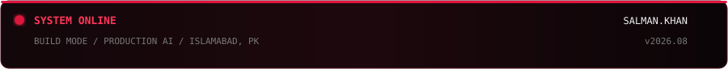

<div align="center">

<!-- ═══════════════════════════════════════════════════════════════ -->
<!-- TYPEWRITER — intentionally ABOVE the terminal hero -->
<!-- ═══════════════════════════════════════════════════════════════ -->


<br/>

<!-- YOUR EXISTING CUSTOM TERMINAL SVG -->


<br/><br/>



<br/>


</div>

---

<div align="center">


### `01  /  IDENTITY`

# **SALMAN KHAN**

**AI Engineer · Full Stack Developer · Builder**

I design and build intelligent software systems — from **LLM applications, RAG pipelines and autonomous agents** to **real-time computer vision, voice AI and full-stack products**.

**BS Artificial Intelligence · NUML · CGPA 3.56**  
**Islamabad, Pakistan · Open to opportunities**


</div>

## `02  /  THE SYSTEMS I BUILD`

<div align="center">

<table>
<tr>
<td align="center" width="25%">

### `LLM`
**INTELLIGENCE**

RAG  
Context Engineering  
Prompt Systems  
Fine-tuning

</td>
<td align="center" width="25%">

### `AGENTS`
**AUTONOMY**

Tool Calling  
Multi-Agent Systems  
Orchestration  
Workflows

</td>
<td align="center" width="25%">

### `VISION`
**PERCEPTION**

YOLO  
Detection  
Pose Estimation  
Real-time CV

</td>
<td align="center" width="25%">

### `VOICE`
**INTERACTION**

STT  
TTS  
WebSockets  
Real-time Agents

</td>
</tr>
</table>

<br/>


</div>

---

## `03  /  SELECTED BUILDS`

<table>
<tr>
<td width="50%" valign="top">

<div align="center">

### `01` — **SURAKSHA AI**

**Defense Intelligence / Computer Vision**

</div>

Real-time surveillance platform combining modern object detection and NLP threat analysis.

```text
30 FPS          92% drone recall
90% F1          YOLOv8 / YOLOv11
```

`PYTHON` `PYTORCH` `FASTAPI` `DISTILBERT`

<div align="center">

**[ SOURCE →](https://github.com/codewithsalty/Suraksha-AI)** · **[ DEMO →](https://suraksha-ai-pakistan.netlify.app)**

</div>

</td>
<td width="50%" valign="top">

<div align="center">

### `02` — **TALEEM AI**

**Bilingual RAG Learning Platform**

</div>

Voice-first AI tutor built around curriculum-grounded retrieval, automated quizzes, flashcards and progression.

```text
RAG              Voice AI
Learning         Automation
```

`NEXT.JS` `LANGCHAIN` `FIREBASE` `GROQ`

<div align="center">

**[ SOURCE →](https://github.com/codewithsalty/Taleem-AI)**

</div>

</td>
</tr>

<tr>
<td width="50%" valign="top">

<div align="center">

### `03` — **NEUROASSIST AI**

**Brain Tumor Classification**

</div>

ANN-CNN hybrid for glioma, meningioma and pituitary tumor classification from MRI data.

```text
99.2% reported accuracy
3,000+ MRI images
```

`TENSORFLOW` `KERAS` `FASTAPI` `STREAMLIT`

<div align="center">

**[ SOURCE →](https://github.com/S4lmankhan/NeuroAssistAiModel)** · **[ DEMO →](https://neuroassistai.vercel.app)**

</div>

</td>
<td width="50%" valign="top">

<div align="center">

### `04` — **CALLROLIN**

**Production Voice AI**

</div>

Real-time voice agent work focused on TTS optimization, latency and custom Urdu voice data.

```text
50+ live calls
500ms → 300ms latency
```

`PYTHON` `FASTAPI` `WEBSOCKETS`

<div align="center">

**[ GITHUB →](https://github.com/codewithsalty)**

</div>

</td>
</tr>

<tr>
<td width="50%" valign="top">

<div align="center">

### `05` — **PEARLS AQI**

**Real-Time Air Quality Forecasting**

</div>

Serverless ML pipeline with hourly ingestion, retraining and multi-step forecasting.

```text
72-hour forecast
<85ms inference
```

`XGBOOST` `FASTAPI` `NEXT.JS` `MONGODB`

<div align="center">

**[ SOURCE →](https://github.com/codewithsalty/aqi-predictor)** · **[ LIVE →](https://pearls-aqi.vercel.app)**

</div>

</td>
<td width="50%" valign="top">

<div align="center">

### `06` — **MEDGUARDIAN AI**

**Multimodal Healthcare Assistant**

</div>

Multimodal AI platform combining OCR and language-model workflows for symptom analysis and decision support.

```text
OCR              Multimodal AI
RAG / LLM        API-first
```

`LANGCHAIN` `FASTAPI` `MONGODB`

<div align="center">

**[ GITHUB →](https://github.com/codewithsalty)**

</div>

</td>
</tr>
</table>

<div align="center">


**[ EXPLORE ALL REPOSITORIES →](https://github.com/codewithsalty?tab=repositories)**

</div>

---

## `04  /  EXPERIENCE`

<div align="center">

```text
╭──────────────────────────────────────────────────────────────────────╮
│                                                                      │
│  2026   DATA SCIENCE INTERN          10PEARLS PAKISTAN              │
│         └─ Mar — Jun 2026                                             │
│                                                                      │
│  2025   AI ENGINEER INTERN           DEV ROLIN                      │
│         └─ Sep — Dec 2025                                             │
│                                                                      │
│  2025   AI / ML ENGINEER INTERN      ELEVVO PATHWAYS                │
│         └─ Sep — Oct 2025                                             │
│                                                                      │
│  2024   PYTHON INTERN                CODESOFT                       │
│         └─ Jun — Aug 2024                                             │
│                                                                      │
╰──────────────────────────────────────────────────────────────────────╯
```

</div>

---

## `05  /  TECHNICAL ARSENAL`

<div align="center">

### `AI / ML`


<br/>

`LLMs` · `RAG` · `LangChain` · `LangGraph` · `NLP` · `YOLO` · `Computer Vision` · `Fine-tuning`

<br/><br/>

### `FULL STACK`


<br/><br/>

### `DATA / CLOUD / DEVOPS`


<br/><br/>

### `TOOLS`

`CURSOR` · `VS CODE` · `POSTMAN` · `N8N` · `KAGGLE` · `FIGMA`

</div>

---

<div align="center">


## `06  /  GITHUB TELEMETRY`


&nbsp;


<br/><br/>


<br/><br/>

<picture>
  <source media="(prefers-color-scheme: dark)" srcset="https://raw.githubusercontent.com/codewithsalty/codewithsalty/output/github-contribution-grid-snake-dark.svg">
  <source media="(prefers-color-scheme: light)" srcset="https://raw.githubusercontent.com/codewithsalty/codewithsalty/output/github-contribution-grid-snake.svg">
  
</picture>

</div>

---

## `07  /  RECOGNITION`

<div align="center">


<br/><br/>

`CEH v13` · `NAVTTC` · `DEEP LEARNING` · `MACHINE LEARNING`  
`CYBERSECURITY` · `PROMPT ENGINEERING` · `PYTHON FULL STACK` · `NSCT`

</div>

---

## `08  /  CURRENT PROCESS`

<div align="center">

```text
┌─────────────────────────────────────────────────────────────────┐
│                                                                 │
│  [01]  BUILDING PRODUCTION-FOCUSED AI SYSTEMS                  │
│  [02]  EXPLORING AGENTIC WORKFLOWS & AUTOMATION                │
│  [03]  SHIPPING LLM / RAG / VISION / VOICE PRODUCTS            │
│  [04]  TURNING IDEAS INTO DEPLOYABLE SOFTWARE                  │
│                                                                 │
│  STATUS :: OPEN TO OPPORTUNITIES / COLLABORATION               │
│                                                                 │
└─────────────────────────────────────────────────────────────────┘
```

</div>

---

<div align="center">


## `09  /  CONNECT`

<a href="mailto:codewithsalty@gmail.com">

</a>
&nbsp;
<a href="https://linkedin.com/in/s4lmankhan">

</a>
&nbsp;
<a href="https://github.com/codewithsalty">

</a>
&nbsp;
<a href="https://salman-khan.dev">

</a>
&nbsp;
<a href="https://kaggle.com/s4lmankhan">

</a>

<br/><br/>


<br/>

<sub><b>Salman Khan</b> · AI Engineer · Builder · Founder</sub>

</div>
