<div align="center">


<br/>


<br/><br/>

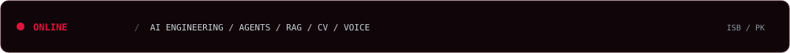

</div>

<div align="center">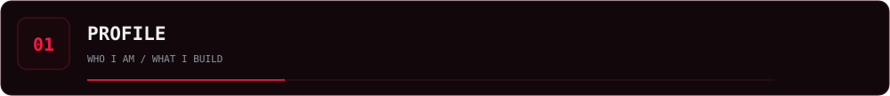</div>

<table>
<tr>
<td width="60%" valign="top">

### AI ENGINEER · BUILDER

I build **production-oriented AI systems** across LLMs, RAG, agents, computer vision, voice AI and full-stack applications.

Currently pursuing **BS Artificial Intelligence at NUML**.

**Islamabad, Pakistan · Open to opportunities**

</td>
<td width="40%" valign="top">

```text
FOCUS
──────────────────
LLMs        ████████
RAG         ████████
AGENTS      ████████
VISION      ███████
VOICE       ███████
FULL STACK  ████████
```

</td>
</tr>
</table>

<div align="center"></div>

---

<div align="center">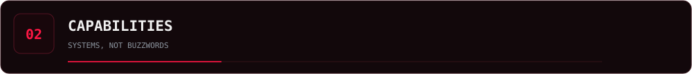</div>

<table>
<tr>
<td align="center" width="25%"><br/><b>LLM SYSTEMS</b><br/><sub>RAG · Context · Fine-tuning</sub></td>
<td align="center" width="25%">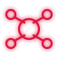<br/><b>AI AGENTS</b><br/><sub>Tools · Orchestration · Workflows</sub></td>
<td align="center" width="25%"><br/><b>COMPUTER VISION</b><br/><sub>YOLO · Detection · Real-time CV</sub></td>
<td align="center" width="25%"><br/><b>VOICE AI</b><br/><sub>STT · TTS · WebSockets</sub></td>
</tr>
</table>

<div align="center">
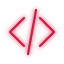 <b>FULL-STACK AI</b>
&nbsp; · &nbsp;
 <b>CLOUD / DEVOPS</b>
&nbsp; · &nbsp;
 <b>DATA SYSTEMS</b>
</div>

---

<div align="center">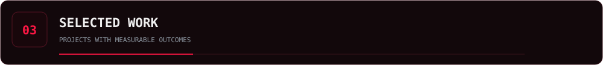</div>

### `01` / SURAKSHA AI
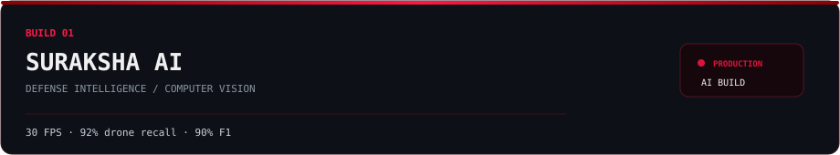
Defense intelligence platform focused on real-time surveillance and threat analysis.

**Stack:** `YOLOv8/v11` · `PyTorch` · `FastAPI` · `DistilBERT`  
**Proof:** `30 FPS` · `92% drone recall` · `90% F1`  
**[SOURCE →](https://github.com/codewithsalty/Suraksha-AI)** · **[DEMO →](https://suraksha-ai-pakistan.netlify.app)**

### `02` / TALEEM AI
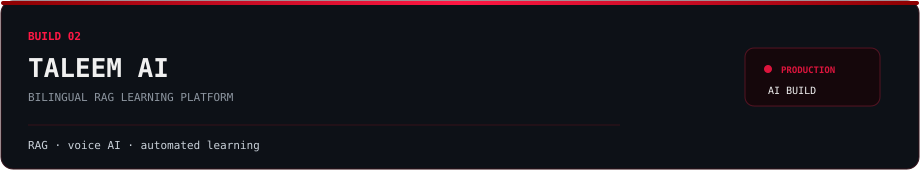
Bilingual, voice-first learning platform using curriculum-grounded RAG and automated learning workflows.

**Stack:** `Next.js` · `LangChain` · `Firebase` · `Groq`  
**Focus:** `RAG` · `Voice AI` · `Quiz Generation` · `Learning Automation`  
**[SOURCE →](https://github.com/codewithsalty/Taleem-AI)**

### `03` / NEUROASSIST AI
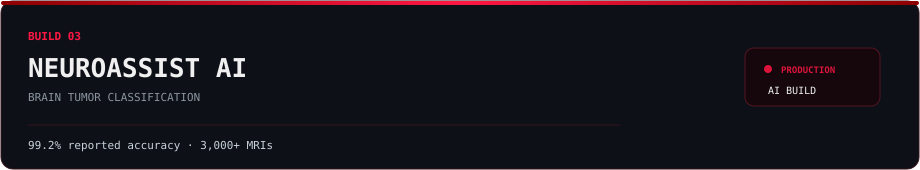
ANN-CNN hybrid for classifying glioma, meningioma and pituitary tumors from MRI data.

**Stack:** `TensorFlow` · `Keras` · `FastAPI` · `Streamlit`  
**Proof:** `99.2% reported accuracy` · `3,000+ MRI images`  
**[SOURCE →](https://github.com/S4lmankhan/NeuroAssistAiModel)** · **[DEMO →](https://neuroassistai.vercel.app)**

### `04` / CALLROLIN
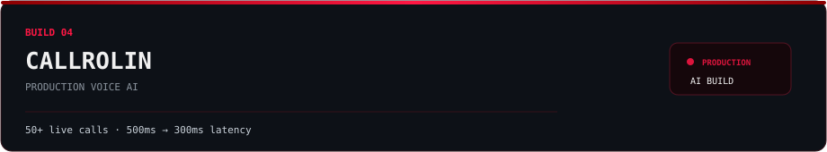
Production voice-agent work focused on latency, TTS and custom Urdu voice data.

**Stack:** `Python` · `FastAPI` · `WebSockets`  
**Proof:** `50+ live calls` · `500ms → 300ms latency`  
**[GITHUB →](https://github.com/codewithsalty)**

### `05` / PEARLS AQI
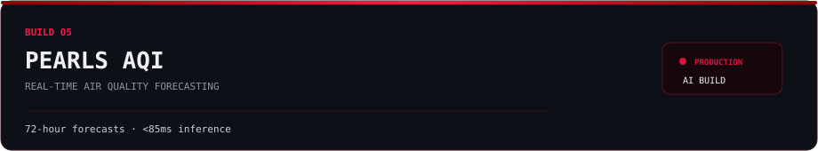
Serverless ML pipeline for air-quality ingestion, retraining and multi-step forecasting.

**Stack:** `XGBoost` · `FastAPI` · `Next.js` · `MongoDB`  
**Proof:** `72-hour forecasts` · `<85ms inference`  
**[SOURCE →](https://github.com/codewithsalty/aqi-predictor)** · **[LIVE →](https://pearls-aqi.vercel.app)**

### `06` / MEDGUARDIAN AI
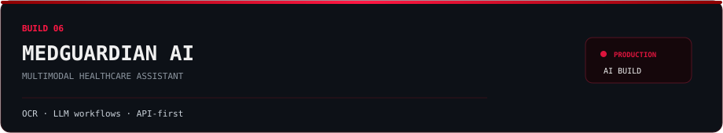
Multimodal healthcare assistant using OCR and language-model workflows for symptom analysis and decision support.

**Stack:** `LangChain` · `FastAPI` · `MongoDB`  
**Focus:** `OCR` · `LLM Workflows` · `Multimodal AI`  
**[GITHUB →](https://github.com/codewithsalty)**

<div align="center">**[ VIEW ALL REPOSITORIES →](https://github.com/codewithsalty?tab=repositories)**</div>

---

<div align="center">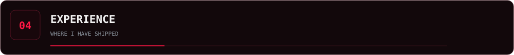</div>

<div align="center">

| YEAR | ROLE | ORGANIZATION |
|:---:|---|---|
| **2026** | Data Science Intern | **10Pearls Pakistan** |
| **2025** | AI Engineer Intern | **Dev Rolin** |
| **2025** | AI / ML Engineer Intern | **Elevvo Pathways** |
| **2024** | Python Intern | **CodeSoft** |

</div>

---

<div align="center">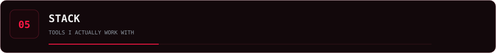</div>

<div align="center">

### AI / ML

<br/>`LLMs` · `RAG` · `LangChain` · `LangGraph` · `NLP` · `YOLO` · `Computer Vision`

### FULL STACK


### DATA / CLOUD / DEVOPS


### TOOLS
`Cursor` · `VS Code` · `Postman` · `n8n` · `Kaggle` · `Figma`

</div>

---

<div align="center"></div>

<div align="center">

&nbsp;

<br/><br/>

<br/><br/>
<picture>
<source media="(prefers-color-scheme: dark)" srcset="https://raw.githubusercontent.com/codewithsalty/codewithsalty/output/github-contribution-grid-snake-dark.svg">
<source media="(prefers-color-scheme: light)" srcset="https://raw.githubusercontent.com/codewithsalty/codewithsalty/output/github-contribution-grid-snake.svg">

</picture>
<br/><br/>

</div>

<div align="center">

<br/>
`CEH v13` · `NAVTTC` · `Deep Learning` · `Machine Learning` · `CyberSecurity` · `Prompt Engineering` · `Python Full Stack` · `NSCT`
</div>

---

<div align="center">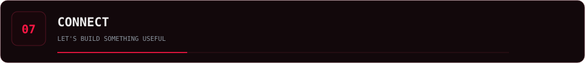</div>

<div align="center">
<a href="mailto:codewithsalty@gmail.com"></a>
&nbsp;&nbsp;&nbsp;
<a href="https://linkedin.com/in/s4lmankhan"></a>
&nbsp;&nbsp;&nbsp;
<a href="https://github.com/codewithsalty"></a>
&nbsp;&nbsp;&nbsp;
<a href="https://salman-khan.dev"></a>

<br/><br/>
<a href="mailto:codewithsalty@gmail.com">EMAIL</a> ·
<a href="https://linkedin.com/in/s4lmankhan">LINKEDIN</a> ·
<a href="https://github.com/codewithsalty">GITHUB</a> ·
<a href="https://salman-khan.dev">PORTFOLIO</a>

<br/><br/>
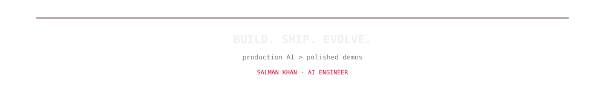

</div>
